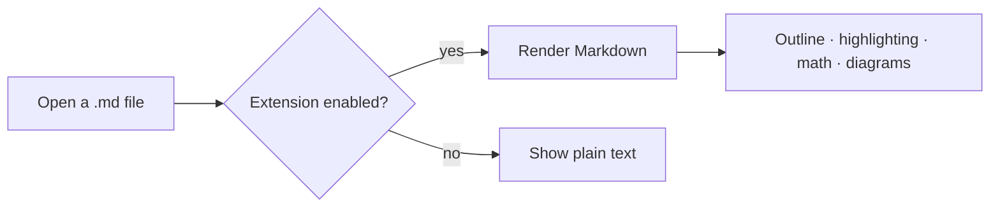
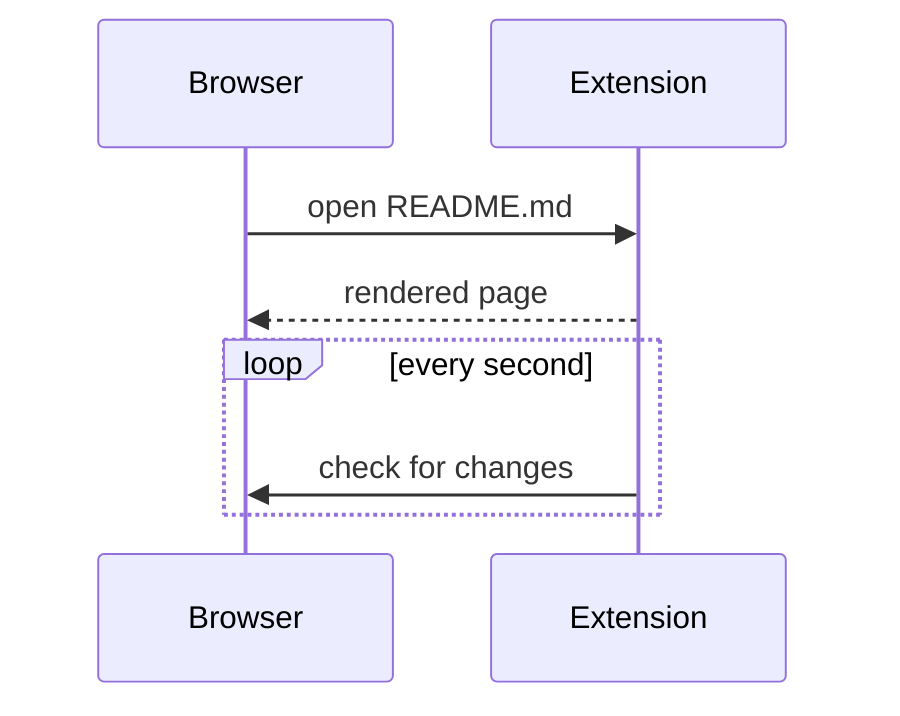

# Markdown Preview · Feature tour

This document shows what the **Markdown Preview** extension renders: edit on the left, see the result on the right.

> [!TIP]
> Open any `.md` file in Chrome to render it. Local files re-render automatically when you save them.

## Basics

**Bold**, *italic*, ~~strikethrough~~, `inline code`, <kbd>Ctrl</kbd> + <kbd>C</kbd>, <mark>highlight</mark>, H<sub>2</sub>O, x<sup>2</sup>.

Autolinks like https://github.com, footnotes[^1] and emoji shortcodes :tada: :rocket: :sparkles:

- Bullet list
  - Nested item
    - One more level
- [x] Finished task
- [ ] Open task

1. Ordered list
2. Second item
3. Third item

> A quote with *formatting* and `code`.

## Tables

| Feature | Supported | Notes |
| :--- | :---: | ---: |
| GFM tables | ✅ | left / center / right |
| Task lists | ✅ | `- [ ]` / `- [x]` |
| Math | ✅ | KaTeX |
| Diagrams | ✅ | Mermaid |

## Syntax highlighting

```js
// Fibonacci numbers
const fib = (n) => (n < 2 ? n : fib(n - 1) + fib(n - 2));
console.log(Array.from({ length: 10 }, (_, i) => fib(i)));
```

```python
from dataclasses import dataclass

@dataclass
class Point:
    x: float
    y: float

    def norm(self) -> float:
        return (self.x ** 2 + self.y ** 2) ** 0.5
```

```diff
- theme: light
+ theme: auto
```

## Math

Inline math $E = mc^2$ and $\sum_{i=1}^{n} i = \frac{n(n+1)}{2}$.

$$
\int_{-\infty}^{+\infty} e^{-x^2}\,dx = \sqrt{\pi}
$$

```math
\begin{pmatrix} a & b \\ c & d \end{pmatrix}^{-1}
= \frac{1}{ad - bc}\begin{pmatrix} d & -b \\ -c & a \end{pmatrix}
```

## Mermaid diagrams





## Alerts

> [!NOTE]
> Useful information.

> [!IMPORTANT]
> Key information.

> [!WARNING]
> Needs attention.

> [!CAUTION]
> Potentially harmful actions.

## Collapsible sections

<details>
<summary>Click to expand</summary>

Collapsed content supports **Markdown** too.

</details>

---

[^1]: A footnote. Use the arrow to jump back to the text.
