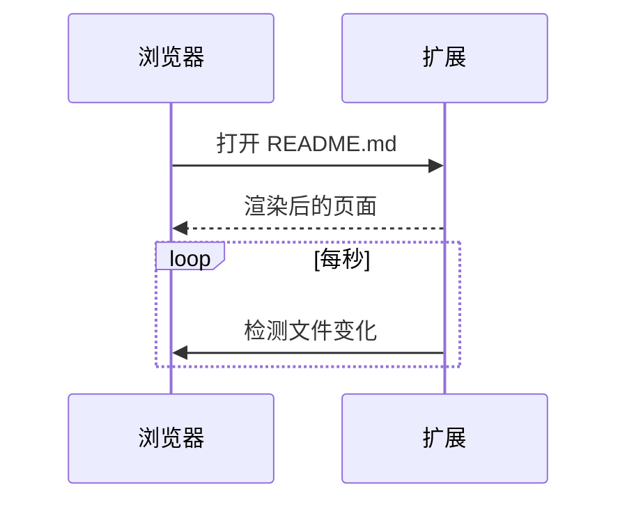

# Markdown 预览 · 功能示例

这是一份展示 **Markdown 预览** 扩展渲染效果的示例文档：左侧编辑，右侧实时预览。

> [!TIP]
> 在 Chrome 中直接打开任意 `.md` 文件即可自动渲染；本地文件保存后，页面会自动刷新。

## 基础语法

**粗体**、*斜体*、~~删除线~~、`行内代码`、<kbd>Ctrl</kbd> + <kbd>C</kbd>、<mark>高亮</mark>、H<sub>2</sub>O、x<sup>2</sup>。

自动链接 https://github.com ，脚注[^1]，Emoji 短代码 :tada: :rocket: :sparkles:

- 无序列表
  - 嵌套项目
    - 更深一层
- [x] 已完成的任务
- [ ] 未完成的任务

1. 有序列表
2. 第二项
3. 第三项

> 引用文字，可以包含 *格式* 与 `代码`。

## 表格

| 功能 | 支持 | 说明 |
| :--- | :---: | ---: |
| GFM 表格 | ✅ | 左 / 中 / 右对齐 |
| 任务列表 | ✅ | `- [ ]` / `- [x]` |
| 数学公式 | ✅ | KaTeX |
| 图表 | ✅ | Mermaid |

## 代码高亮

```js
// 斐波那契数列
const fib = (n) => (n < 2 ? n : fib(n - 1) + fib(n - 2));
console.log(Array.from({ length: 10 }, (_, i) => fib(i)));
```

```python
from dataclasses import dataclass

@dataclass
class Point:
    x: float
    y: float

    def norm(self) -> float:
        return (self.x ** 2 + self.y ** 2) ** 0.5
```

```diff
- theme: light
+ theme: auto
```

## 数学公式

行内公式 $E = mc^2$，求和 $\sum_{i=1}^{n} i = \frac{n(n+1)}{2}$。

$$
\int_{-\infty}^{+\infty} e^{-x^2}\,dx = \sqrt{\pi}
$$

```math
\begin{pmatrix} a & b \\ c & d \end{pmatrix}^{-1}
= \frac{1}{ad - bc}\begin{pmatrix} d & -b \\ -c & a \end{pmatrix}
```

## Mermaid 图表




## 提示块

> [!NOTE]
> 普通提示信息。

> [!IMPORTANT]
> 重要信息。

> [!WARNING]
> 需要注意的内容。

> [!CAUTION]
> 可能造成问题的操作。

## 折叠内容

<details>
<summary>点击展开</summary>

折叠区域里同样支持 **Markdown**。

</details>

---

[^1]: 这是一个脚注，点击右侧箭头可以跳回正文。
