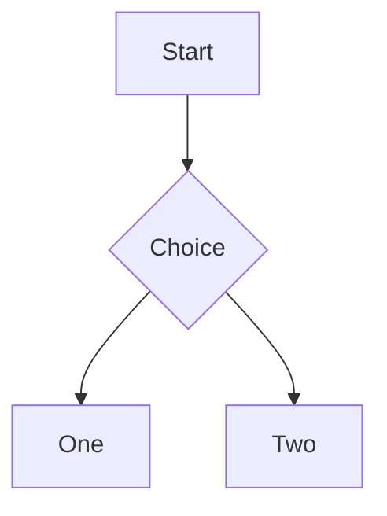
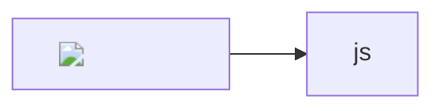

# Hello World

Intro paragraph with **bold**, *italic*, ~~strike~~ and `code`. Emoji :rocket:.

## Title

Heading text that DOMPurify would treat as clobbering ("title").

## Duplicate

## Duplicate

## 中文标题

Mentions README.md and setup.py stay plain; www.example.com and https://example.org/path are links.
[local file](file:///etc/hosts) and [relative](other.md#section).

### Task list

- [x] done item
- [ ] open item

### Table

| Left | Center | Right |
| :--- | :----: | ----: |
| a    |   b    |     c |

### Code

```js
const answer = 42;
function greet(name) {
  return `hello ${name}`;
}
```

```unknownlang
plain text block
```

### Math

Inline $a_1 * b_2 = c$ and money $5 and $10 stay text.

$$
\int_0^1 x^2 \, dx = \frac{1}{3}
$$

### Diagram



```mermaid
this is not a valid diagram
```

### Alerts

> [!NOTE]
> A note.

> [!WARNING]
> A warning.

### Footnote

Text with a footnote.[^note]

[^note]: The footnote text.

### Unsafe HTML


<script>window.__xss = 'script';</script>
<a href="javascript:window.__xss = 'link'">js link</a>
[md js link](javascript:alert(1))
<iframe src="https://example.com"></iframe>
<style>body { display: none !important; }</style>
<form name="body"><input name="cookie"></form>
<details open ontoggle="window.__xss = 'details'"><summary>x</summary></details>
<input autofocus onfocus="window.__xss = 'focus'">
<svg><animate onbegin="window.__xss = 'svg'" attributeName="x" dur="1s"></animate></svg>
<video src="missing.mp4" onerror="window.__xss = 'video'"></video>

Math link: $\href{javascript:window.__xss='katex'}{click}$



<details>
<summary>More</summary>

Hidden **content**.

</details>

<picture>
  <source media="(prefers-color-scheme: dark)" srcset="dark.png">
  
</picture>
